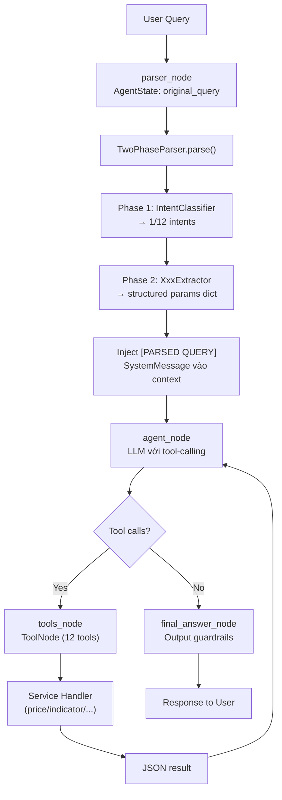

# Financial Insight Agent

**LLM Agent for Vietnamese Stock Analysis**

Financial Insight Agent là hệ thống AI phân tích chứng khoán, trả lời câu hỏi tiếng Việt về thị trường chứng khoán bằng kết hợp **two-phase query parsing**, **LLM tool-calling** và **dữ liệu thị trường thời gian thực**.

---

## 🚀 Project Overview

- Hệ thống trợ lý tài chính sử dụng **LLM agent** để phân tích và trả lời câu hỏi chứng khoán Việt Nam.
- Hỗ trợ 12 loại truy vấn: giá, chỉ báo kỹ thuật, thông tin công ty, so sánh, xếp hạng, tổng hợp, tỷ lệ tài chính, tin tức, danh mục, cảnh báo, dự báo, phân tích ngành.
- **Two-phase parsing pipeline**: Phase 1 (Intent Classification) + Phase 2 (Parameter Extraction).
- Agent sử dụng **LangGraph** với tool-calling LLM.
- Logging, caching, circuit breaker, guardrails.

---

## ✨ Features

### Two-Phase Query Parsing

**Phase 1 — Intent Classification:**
- LLM classify query thành 1 trong 12 intents (price, aggregate, compare, indicator, company, ranking, financial_ratio, news_sentiment, portfolio, alert, forecast, sector).
- Fallback: keyword matching → JSON extract → default "price".
- Prompt lightweight (~20 dòng), không chứa schema chi tiết.

**Phase 2 — Parameter Extraction:**
- 12 extractors riêng biệt, mỗi extractor có 1 prompt + Pydantic model.
- Mỗi extractor chỉ extract params cho đúng intent của nó.
- Fallback dict cho mỗi extractor nếu LLM/parse fails.

**Orchestrator:**
- `TwoPhaseParser` kết hợp Phase 1 + Phase 2, inject [PARSED QUERY] vào context của agent LLM.

### Agent Pipeline (LangGraph)

```
parser_node → agent_node ⇄ tools_node → final_answer → END
```

- **parser_node**: TwoPhaseParser → structured params dict
- **agent_node**: LLM với [PARSED QUERY] context, tự động gọi tool phù hợp
- **tools_node**: 12 LangChain tools, mỗi tool gọi 1 service handler
- **final_answer_node**: Output guardrails + response

### 12 Query Types

| Query Type | Service Handler | Parameters |
|-----------|----------------|------------|
| price_query | handle_price_query | tickers, requested_field, time |
| indicator_query | handle_indicator_query | tickers, indicator_type, period, time |
| comparison_query | handle_compare_query | tickers, compare_with, requested_field, time |
| ranking_query | handle_ranking_query | tickers (>=2), requested_field, aggregate, time |
| aggregate_query | handle_aggregate_query | tickers, requested_field, aggregate_fn, time |
| financial_ratio_query | handle_financial_ratio_query | tickers, requested_field, period |
| company_query | handle_company_query | tickers, requested_field |
| news_sentiment_query | handle_news_sentiment_query | tickers, requested_field, time |
| portfolio_query | handle_portfolio_query | requested_field, portfolio |
| alert_query | handle_alert_query | tickers, threshold, condition |
| forecast_query | handle_forecast_query | tickers, timeframe, model |
| sector_query | handle_sector_query | sector, metric, timeframe |

### Reliability & Observability

- **Input guardrails**: validate length, detect injection/XSS/PII
- **Output guardrails**: sanitize response, redact PII
- **Circuit breaker**: tự động ngắt LLM calls khi lỗi liên tiếp
- **Logging**: request_id tracing xuyên suốt pipeline
- **Caching**: Redis cache cho truy vấn lặp lại

---

## 🧱 Project Structure

```
src/
├── domain/                         # Business logic
│   ├── entities/                   # HistoricalQuery, QueryType, Interval, RequestedField
│   └── schemas/                    # 12 Pydantic schemas (price, indicator, aggregate, ...)
│
├── application/                    # Use cases & routing
│   ├── agents/
│   │   ├── agent.py                # StockAgent (LangGraph graph)
│   │   ├── tool_registry.py        # 12 @tool wrappers
│   │   ├── hybrid_splitter.py      # Multi-intent query splitter
│   │   └── response_formatter.py   # Deprecated (kept for compat)
│   └── services/
│       ├── market/                 # price, indicator, compare, alert, forecast, sector
│       ├── financial/              # aggregate, financial_ratio, ranking
│       ├── company/                # company
│       └── portfolio/              # portfolio, news_sentiment
│
├── infrastructure/                 # External services
│   ├── llm/
│   │   ├── two_phase_parser.py     # Orchestrator: Phase 1 + Phase 2
│   │   ├── intent_classifier.py    # Phase 1: 12-intent classification
│   │   ├── query_preprocessor.py   # Rule-based preprocessing (legacy)
│   │   ├── llm_provider.py         # OpenAI primary + Groq fallback
│   │   └── extractors/             # Phase 2: 12 extractors
│   │       ├── aggregate_extractor.py
│   │       ├── comparison_extractor.py
│   │       ├── indicator_extractor.py
│   │       ├── price_extractor.py
│   │       ├── company_extractor.py
│   │       ├── ranking_extractor.py
│   │       ├── financial_ratio_extractor.py
│   │       ├── news_sentiment_extractor.py
│   │       ├── portfolio_extractor.py
│   │       ├── alert_extractor.py
│   │       ├── forecast_extractor.py
│   │       └── sector_extractor.py
│   ├── api_clients/                # VNStockClient
│   ├── cache/                      # Redis caching
│   └── resilience/                 # Circuit breaker, guardrails
│
├── interfaces/                     # FastAPI, CLI
├── shared/                         # Shared utilities
└── tests/
    └── unit/                       # 10 test files, ~101 tests collected
        ├── test_two_phase_parser.py
        ├── test_query_parser.py
        ├── test_query_parser_simple.py
        ├── test_enhanced_parser.py
        ├── test_financial_services.py
        ├── test_market_services.py
        ├── test_portfolio_services.py
        ├── test_query_preprocessor.py
        ├── test_time_processor.py
        └── test_vn_stock_client.py
```

---

## 🔄 Agent Workflow



### Node Responsibilities

| Node | Vai trò | File |
|------|---------|------|
| `parser_node` | TwoPhaseParser: classify intent → extract params → inject context | `agent.py:79` |
| `agent_node` | LLM với [PARSED QUERY] context, quyết định tool cần gọi | `agent.py:107` |
| `tools_node` | LangGraph ToolNode chứa 12 @tool functions | `tool_registry.py` |
| `final_answer_node` | Output guardrails validation + sanitization | `agent.py:171` |

### Tool Registry

`tool_registry.py` định nghĩa 12 LangChain tools, mỗi tool wrapper gọi 1 service handler:

```python
@tool("handle_price_query", description="...")
def handle_price_query_tool(query=None) -> str:
    # validate → call service → JSON string → error handling
```

Router map `_tool_by_query_type`:

```python
_tool_by_query_type = {
    "price_query": handle_price_query_tool,
    "indicator_query": handle_indicator_query_tool,
    "comparison_query": handle_compare_query_tool,
    "ranking_query": handle_ranking_query_tool,
    "aggregate_query": handle_aggregate_query_tool,
    "financial_ratio_query": handle_financial_ratio_query_tool,
    "company_query": handle_company_query_tool,
    "news_sentiment_query": handle_news_sentiment_query_tool,
    "portfolio_query": handle_portfolio_query_tool,
    "alert_query": handle_alert_query_tool,
    "forecast_query": handle_forecast_query_tool,
    "sector_query": handle_sector_query_tool,
}
```

---

## 🧪 Testing

```bash
pytest src/tests/unit/ -v
# ~101 tests collected
```

Test categories:

| File | Tests | What it covers |
|------|-------|----------------|
| `test_two_phase_parser.py` | 65 | Intent parse, Pydantic models, _to_dict, routing, fallbacks |
| `test_query_parser.py` | 1 | Integration: TwoPhaseParser with real queries |
| `test_query_parser_simple.py` | 1 | Integration: subset of queries |
| `test_enhanced_parser.py` | 1 | Integration: 12 query types + all services |
| `test_financial_services.py` | 12 | Financial ratio, aggregate, ranking service handlers |
| `test_market_services.py` | 13 | Compare, indicator, price service handlers |
| `test_portfolio_services.py` | 8 | News sentiment, portfolio service handlers |

---

## ▶️ Getting Started

```bash
python -m venv .venv
source .venv/bin/activate  # Windows: .venv\Scripts\activate
pip install -r requirements.txt
```

Cấu hình biến môi trường:

```bash
export GROQ_API_KEY=your_api_key_here
# hoặc
export OPENAI_API_KEY=your_api_key_here
```

### Usage

```python
from infrastructure.llm.two_phase_parser import TwoPhaseParser

parser = TwoPhaseParser()
result = parser.parse("Giá đóng cửa của VCB hôm qua?")
print(result)
# {'query_type': 'price_query', 'tickers': ['VCB'], 'requested_field': 'close', 'days': 1}
```

```python
from application.agents.agent import StockAgent

agent = StockAgent()
response = agent.run("Tỷ lệ P/E của VNM hiện tại là bao nhiêu?")
print(response)
```

### Query Examples

```python
# Price
"Giá đóng cửa của VCB hôm qua?"

# Indicator
"Tính SMA9 cho VCB trong 1 tuần gần nhất."

# Company
"Cổ đông lớn nhất của VNM là ai?"

# Comparison
"So sánh khối lượng giao dịch của VIC với HPG trong 1 tuần."

# Ranking
"Trong các mã FPT, MWG, VNM mã nào có giá cao nhất?"

# Aggregate
"Tổng khối lượng giao dịch của HPG trong 1 tuần."

# Financial ratio
"PE của VNM hiện tại là bao nhiêu?"

# News sentiment
"Có tin tức gì về VCB trong tuần này không?"

# Portfolio
"Nếu tôi mua 100 cổ FPT thì danh mục hiện tại ra sao?"

# Alert
"Cảnh báo khi giá HPG vượt ngưỡng 50.000"

# Forecast
"Dự báo giá VNM trong tuần tới"

# Sector
"Hiệu suất ngành ngân hàng tuần này thế nào?"
```

---

## 🎯 Purpose

Dự án chứng minh khả năng:
- Thiết kế **LLM agent production-like systems** với LangGraph
- **Two-phase query parsing**: intent classification → focused extraction
- **12 specialized extractors**, mỗi extractor có prompt riêng
- **Clean architecture**: domain → application → infrastructure
- **Reliability**: circuit breaker, guardrails, fallback chains
- **Observability**: request_id tracing, logging, metrics

---

## 🤝 Contributing

- Issue và Pull Request luôn được chào đón
- Tuân thủ PEP8 và có test đi kèm khi mở PR
- Đảm bảo backward compatibility cho các tính năng hiện có
