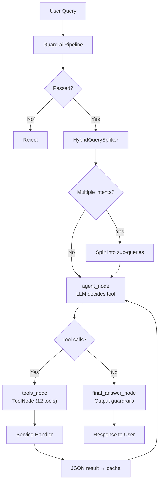

# Financial Insight Agent

**LLM Agent for Vietnamese Stock Analysis**

Financial Insight Agent là hệ thống AI phân tích chứng khoán sử dụng **LangGraph ReAct agent** với tool-calling LLM, trả lời câu hỏi tiếng Việt về thị trường chứng khoán dựa trên dữ liệu thời gian thực.

---

## 🚀 Project Overview

- Hệ thống trợ lý tài chính sử dụng **LLM agent** (ReAct pattern) để phân tích và trả lời câu hỏi chứng khoán Việt Nam.
- Agent được xây dựng với **LangGraph StateGraph**, có khả năng tự động quyết định gọi tool nào dựa trên ngữ cảnh.
- Hỗ trợ 12 loại truy vấn: giá, chỉ báo kỹ thuật, thông tin công ty, so sánh, xếp hạng, tổng hợp, tỷ lệ tài chính, tin tức, danh mục, cảnh báo, dự báo, phân tích ngành.
- Tích hợp: input/output guardrails, circuit breaker, Redis caching, structured logging, metrics, rate limiting.

---

## ✨ Features

### Agent Pipeline (LangGraph ReAct)

```
HybridSplitter → agent_node ⇄ tools_node (loop) → final_answer → END
```

- **HybridSplitter**: Tách câu hỏi đa intent thành các sub-query độc lập (rule-based + LLM fallback).
- **agent_node**: LLM (OpenAI GPT-4o-mini, fallback Groq Llama) tự động quyết định tool cần gọi.
- **tools_node**: LangGraph `ToolNode` chứa 12 `@tool` functions.
- **final_answer_node**: Output guardrails + sanitization.

### 12 Tool Types

| Tool | Service Handler | Parameters |
|------|----------------|------------|
| `get_stock_price` | handle_price_query | tickers, requested_field, time |
| `calculate_technical_indicator` | handle_indicator_query | tickers, indicator_type, period, time |
| `compare_stocks` | handle_compare_query | tickers, compare_with, requested_field, time |
| `rank_stocks` | handle_ranking_query | tickers, requested_field, aggregate, time |
| `aggregate_prices` | handle_aggregate_query | tickers, requested_field, aggregate_fn, time |
| `get_financial_ratios` | handle_financial_ratio_query | tickers, requested_field, period |
| `get_company_info` | handle_company_query | tickers, requested_field |
| `get_news_and_sentiment` | handle_news_sentiment_query | tickers, requested_field, time |
| `manage_portfolio` | handle_portfolio_query | requested_field, portfolio |
| `check_price_alert` | handle_alert_query | tickers, threshold, condition |
| `forecast_stock_price` | handle_forecast_query | tickers, timeframe, model |
| `analyze_sector` | handle_sector_query | sector, metric, timeframe |

### Reliability & Observability

- **Input guardrails**: validate length, detect injection/XSS/PII, rate limiting
- **Output guardrails**: sanitize response, redact PII, detect anomalies
- **Circuit breaker**: tự động ngắt LLM calls khi lỗi liên tiếp
- **Logging**: request_id tracing xuyên suốt pipeline (structured JSON)
- **Caching**: in-memory L1 + Redis L2 cache
- **Metrics**: request count, latency, error rate

---

## 🧱 Project Structure

```
src/
├── application/                    # Use cases & orchestration
│   ├── agents/
│   │   ├── agent.py                # StockAgent (LangGraph StateGraph)
│   │   ├── tool_registry.py        # 12 @tool wrappers
│   │   └── hybrid_splitter.py      # Multi-intent query splitter
│   └── services/                   # Business logic handlers
│       ├── market/                 # price, indicator, compare, alert, forecast, sector
│       ├── financial/              # aggregate, financial_ratio, ranking
│       ├── company/                # company
│       └── portfolio/              # portfolio, news_sentiment
│
├── domain/                         # Business entities & schemas
│   ├── entities/                   # HistoricalQuery, Interval, RequestedField
│   └── schemas/                    # 12 Pydantic models (price, indicator, ...)
│
├── infrastructure/                 # External services & cross-cutting
│   ├── api_clients/                # VNStockClient
│   ├── cache/                      # Redis cache + in-memory L1
│   ├── guardrails/                 # Input guardrails pipeline
│   ├── llm/
│   │   ├── llm_provider.py         # OpenAI primary + Groq fallback
│   ├── memory/                     # Short-term, episodic, long-term memory
│   ├── observability/              # Structured logging, metrics, alerting
│   └── resilience/                 # Circuit breaker, output guardrails
│
├── interfaces/                     # Entry points
│   ├── api/app.py                  # FastAPI (POST /ask-stream, /health, /ping)
│   └── cli/console.py              # Interactive CLI
│
├── shared/                         # Shared utilities
│   ├── base_service.py             # BaseService with parallel ticker fetching
│   ├── price_data.py               # Price data helpers
│   └── utils/                      # calculations.py, time_processor.py
│
└── tests/
    ├── unit/                       # 22 test files
    ├── integration/                # E2E tests
    └── spec_drift/                 # Schema validation tests
```

---

## 🔄 Agent Workflow


```mermaid
flowchart TD
    A["User Query"] --> B["GuardrailPipeline"]
    B --> C{"Passed?"}
    C -->|"No"| D["Reject"]
    C -->|"Yes"| E["HybridQuerySplitter"]
    E --> F{"Multiple intents?"}
    F -->|"No"| G["agent_node<br>LLM decides tool"]
    F -->|"Yes"| H["Split into sub-queries"]
    H --> G
    G --> I{"Tool calls?"}
    I -->|"Yes"| J["tools_node<br>ToolNode (12 tools)"]
    J --> K["Service Handler"]
    K --> L["JSON result → cache"]
    L --> G
    I -->|"No"| M["final_answer_node<br>Output guardrails"]
    M --> N["Response to User"]
```

### Node Responsibilities

| Node | Vai trò | File |
|------|---------|------|
| `agent_node` | LLM với tool-calling, quyết định tool cần gọi | `agent.py` |
| `tools_node` | LangGraph ToolNode, dispatch tool calls theo tên | `tool_registry.py` |
| `final_answer_node` | Output guardrails validation + sanitization | `agent.py` |

### ReAct Loop

1. **agent_node**: LLM nhận query + chat history, trả về `AIMessage` (có thể chứa `tool_calls`).
2. **Conditional edge**: Nếu có `tool_calls` → tools_node. Nếu không → final_answer_node.
3. **tools_node**: LangGraph `ToolNode` tự động gọi đúng function theo tên tool.
4. Lặp lại từ bước 1 cho đến khi LLM trả lời trực tiếp (không gọi tool) hoặc đạt max iterations (default 10).

---

## 🧪 Testing

```bash
pytest src/tests/ -v
```

Test categories:

| File | What it covers |
|------|----------------|
| `unit/test_tool_registry.py` | Tool function signatures and routing |
| `unit/test_hybrid_splitter.py` | Multi-intent query splitting |
| `unit/test_market_services.py` | Price, indicator, compare service handlers |
| `unit/test_financial_services.py` | Financial ratio, aggregate, ranking service handlers |
| `unit/test_portfolio_services.py` | News sentiment, portfolio service handlers |
| `unit/test_base_service.py` | Base service layer |
| `unit/test_cache_*.py` | Redis + in-memory cache |
| `unit/test_circuit_breaker.py` | Circuit breaker state machine |
| `unit/test_guardrail_pipeline.py` | Input guardrails |
| `unit/test_output_guardrails.py` | Output guardrails |
| `unit/test_llm_provider.py` | LLM provider with fallback |
| `unit/test_memory_*.py` | Memory manager |
| `unit/test_domain_entities.py` | Domain entities |
| `unit/test_calculations.py` | Financial calculations |
| `unit/test_time_processor.py` | Time processing utilities |
| `unit/test_price_data.py` | Price data helpers |
| `unit/test_vn_stock_client.py` | VNStock client adapter |
| `unit/test_cli_console.py` | CLI console |
| `integration/test_agent_e2e.py` | Full agent end-to-end |
| `integration/test_api_endpoints.py` | API endpoint testing |
| `integration/test_enhanced_agent.py` | Agent with edge cases |
| `integration/test_full_system.py` | Full system integration |

---

## ▶️ Getting Started

```bash
python -m venv .venv
.venv\Scripts\activate  # Windows
pip install -r requirements.txt
```

Cấu hình biến môi trường:

```bash
export OPENAI_API_KEY=your_api_key_here
# hoặc
export GROQ_API_KEY=your_api_key_here  # fallback
```

### Usage

```python
from application.agents.agent import StockAgent

agent = StockAgent()
response = agent.run("Tỷ lệ P/E của VNM hiện tại là bao nhiêu?")
print(response)
```

### Query Examples

```python
# Price
"Giá đóng cửa của VCB hôm qua?"

# Indicator
"Tính SMA9 cho VCB trong 1 tuần gần nhất."

# Company
"Cổ đông lớn nhất của VNM là ai?"

# Comparison
"So sánh khối lượng giao dịch của VIC với HPG trong 1 tuần."

# Ranking
"Trong các mã FPT, MWG, VNM mã nào có giá cao nhất?"

# Aggregate
"Tổng khối lượng giao dịch của HPG trong 1 tuần."

# Financial ratio
"PE của VNM hiện tại là bao nhiêu?"

# News sentiment
"Có tin tức gì về VCB trong tuần này không?"

# Portfolio
"Nếu tôi mua 100 cổ FPT thì danh mục hiện tại ra sao?"

# Alert
"Cảnh báo khi giá HPG vượt ngưỡng 50.000"

# Forecast
"Dự báo giá VNM trong tuần tới"

# Sector
"Hiệu suất ngành ngân hàng tuần này thế nào?"
```

### API

```bash
curl -X POST http://localhost:8000/ask-stream \
  -H "Content-Type: application/json" \
  -d '{"query": "Giá VCB hôm nay?"}'
```

Web dashboard: http://localhost:8000/docs

---

## 🎯 Purpose

Dự án chứng minh khả năng:
- Thiết kế **LLM agent production-like systems** với **LangGraph ReAct pattern**
- **Tool-calling agent** với 12 tools tự động dispatch
- **Clean architecture**: domain → application → infrastructure
- **Reliability**: circuit breaker, guardrails, fallback chains, caching
- **Observability**: request_id tracing, structured logging, metrics

---

## 🤝 Contributing

- Issue và Pull Request luôn được chào đón
- Tuân thủ PEP8 và có test đi kèm khi mở PR
