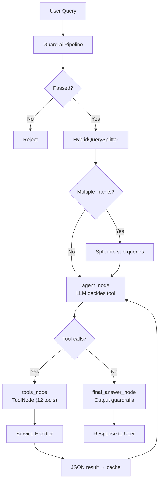

# Financial Insight Agent

**LLM Agent for Vietnamese Stock Analysis**

Financial Insight Agent là hệ thống AI phân tích chứng khoán sử dụng **LangGraph ReAct agent** với tool-calling LLM, trả lời câu hỏi tiếng Việt về thị trường chứng khoán dựa trên dữ liệu thời gian thực.

---

## 🚀 Project Overview

- Hệ thống trợ lý tài chính sử dụng **LLM agent** (ReAct pattern) để phân tích và trả lời câu hỏi chứng khoán Việt Nam.
- Agent được xây dựng với **LangGraph StateGraph**, có khả năng tự động quyết định gọi tool nào dựa trên ngữ cảnh.
- Hỗ trợ 12 loại truy vấn: giá, chỉ báo kỹ thuật, thông tin công ty, so sánh, xếp hạng, tổng hợp, tỷ lệ tài chính, tin tức, danh mục, cảnh báo, dự báo, phân tích ngành.
- Tích hợp: input/output guardrails, circuit breaker, Redis caching, structured logging, metrics, rate limiting.

---

## 💡 Vì sao dự án này tồn tại? — Pain Point Giáo dục Tài chính

> Dự án chuyển từ "demo kỹ thuật ReAct agent" sang **giải bài toán thực tế có bằng chứng**: giúp nhà đầu tư cá nhân Việt Nam ra quyết định có căn cứ, có trích dẫn — thay vì giao dịch cảm tính. Toàn bộ số liệu dưới đây đều có nguồn công khai để bạn tự kiểm chứng.

### 1. Quy mô thị trường — 11–13 triệu tài khoản, tăng rất nhanh

Số tài khoản chứng khoán cá nhân trong nước tăng liên tục: **11,8 triệu cuối 2025** (~11% dân số, tăng thêm 2,6 triệu chỉ trong năm 2025) [Thời báo Tài chính Việt Nam](https://thoibaotaichinhvietnam.vn/so-luong-tai-khoan-chung-khoan-cua-nha-dau-tu-trong-nuoc-da-tang-gan-26-trieu-tai-khoan-trong-nam-2025-190337.html) → vượt mốc **12 triệu (02/2026)** [Vietstock](https://vietstock.vn/2026/02/so-luong-tai-khoan-chung-khoan-tai-viet-nam-vuot-moc-12-trieu-830-1401652.htm) → vượt **13 triệu (05/2026, ~13% dân số)** [Báo Nhân Dân / VSDC](https://baomoi.com/tinh-toi-het-thang-5-2026-viet-nam-chinh-thuc-vuot-moc-13-trieu-tai-khoan-chung-khoan-c55354494.epi). Đây là nhóm người dùng tiềm năng cực lớn và vẫn đang tăng ~13%/năm.

### 2. Hiểu biết tài chính thấp & thiếu kế hoạch dài hạn — có số liệu định lượng

- **S&P Global FinLit Survey 2014** (140 quốc gia): Việt Nam chỉ **24%** dân số trưởng thành hiểu biết tài chính cơ bản — thấp hơn Thái Lan 27%, Indonesia 32%, Malaysia 36%, Singapore 59% [div.gov.vn](https://div.gov.vn/day-manh-pho-cap-tai-chinh-tai-viet-nam).
- **Sun Life Financial Resilience Index 2026**: **59%** người tiêu dùng Việt tự đánh giá kiến thức tài chính chỉ ở mức cơ bản/thấp; nhóm "năng lực tài chính cao" giảm từ 34% (2025) xuống 31% (2026) [Điện tử & Ứng dụng](https://dientuungdung.vn/chi-so-nang-luc-tai-chinh-2026-kha-nang-chong-chiu-tai-chinh-cua-nguoi-viet-vuot-nhieu-thi-truong-trong-khu-vuc-16320.html).
- **TVS "Sức khỏe Tài chính & Niềm tin Đầu tư 2026"** (1.000 người, 5 TP lớn): chỉ **27% có kế hoạch tài chính dài hạn rõ ràng, 73% chưa có** (Sun Life 2026 đưa con số tương tự: 61% không có kế hoạch hoặc chỉ <1 năm); **95% chưa từng dùng dịch vụ tư vấn tài chính trả phí chuyên nghiệp**; "ảo giác an toàn" (85% tự tin xoay được tiền mặt nhưng ~1/2 chỉ thanh khoản được ≤40% tài sản trong 30 ngày); "đa dạng hóa giả" (55% nắm 2–3 kênh, 39% nắm 4–5 kênh nhưng tỉ trọng cổ phiếu/trái phiếu/chứng chỉ quỹ/ngoại tệ vẫn <10%) [Nhịp Cầu Đầu Tư](https://nhipcaudautu.vn/tai-chinh/di-cung-f0/quan-tri-tai-san-va-nghich-ly-cua-niem-tin-3365371/).

> Con số **95% chưa dùng tư vấn trả phí** là quan trọng nhất: nhu cầu định hướng có thật nhưng kênh tư vấn truyền thống gần như không chạm tới số đông.

### 3. Hành vi giao dịch cảm tính, thiếu kỷ luật cắt lỗ

Nhiều nguồn mô tả mẫu hình lặp lại ở nhà đầu tư F0: *"lãi thì chốt non, lỗ thì gồng tới chết"*, thiếu kỷ luật cắt lỗ, dễ cuốn theo tin đồn mạng xã hội [DSC](https://www.dsc.com.vn/kien-thuc/nha-dau-tu-f0-la-gi) [Prudential](https://www.prudential.com.vn/vi/blog-nhip-song-khoe/quan-ly-tai-chinh/nha-dau-tu-f0-la-gi-huong-dan-cho-nguoi-moi-bat-dau/).

> **Lưu ý trích dẫn:** Các con số giật gân như *"90% F0 mất 90% tài sản trong 90 ngày"* hay *"95% NĐT thua lỗ"* xuất hiện trên [Lao Động](https://specials.laodong.vn/90-nha-dau-tu-chung-khoan-f0-mat-90-tai-san-trong-90-ngay-dau-tien-930926/) và trang đào tạo/môi giới nhưng **không có phương pháp khảo sát gốc công khai** — nên dùng như **tín hiệu định tính** về mẫu hình hành vi, không nên trích như thống kê chính xác (đúng khuyến nghị trong tài liệu Pain-Point gốc).

### 4. Bằng chứng sẵn sàng chi trả + Lực đẩy AI mạnh nhất

- **Giá cụ thể:** Simplize — nền tảng phân tích/định giá phổ biến — gói **Premium 499.000đ/tháng** (bên cạnh gói Basic miễn phí) [Vua Chứng Khoán](https://vuachungkhoang.com/simplize/) [seiofva](https://seiofva.com/simplize/) [Simplize](https://simplize.vn/).
- **Vốn vào robo-advisor/app đầu tư nhỏ lẻ:** Finhay (từ 50.000đ), Passion Invest, Tikop, Infina được hậu thuẫn bởi TVS/DNSE — nhưng **UBCKNN 2022 đã cảnh báo** các app này có dấu hiệu hoạt động quản lý quỹ/danh mục khi chưa được cấp phép [Tuổi Trẻ](https://tuoitre.vn/than-trong-voi-ung-dung-dau-tu-finhay-passion-invest-duoc-nguoi-noi-tieng-quang-cao-20221005202138199.htm) [MarketTimes](https://markettimes.vn/dich-vu-cua-passion-invest-finhay-tikop-infina-savenow-buff-chua-duoc-uy-ban-chung-khoan-nha-nuoc-cap-phep-5149.html) — **ranh giới pháp lý quan trọng** nếu sản phẩm đưa khuyến nghị mua/bán cụ thể hoặc quản lý tiền hộ.
- **Tailwind đặc biệt cho AI agent:** **75% người tiêu dùng Việt đã dùng Generative AI để tìm lời khuyên tài chính — tỉ lệ cao nhất khu vực**, 73% dự định tăng dùng trong 12 tháng tới (cũng cao nhất) [Sun Life 2026 — Điện tử & Ứng dụng](https://dientuungdung.vn/chi-so-nang-luc-tai-chinh-2026-kha-nang-chong-chiu-tai-chinh-cua-nguoi-viet-vuot-nhieu-thi-truong-trong-khu-vuc-16320.html). Thị trường không cần "thuyết phục dùng AI cho tài chính" — họ đã dùng rồi, câu hỏi là *dùng công cụ nào đáng tin hơn*.

### 5. Định vị của Financial Insight Agent — Giáo dục có trích dẫn

Thay vì cạnh tranh trực tiếp với Simplize về dữ liệu hay đưa khuyến nghị mua/bán (vướng UBCKNN), dự án chọn **Hướng C — Cổng giáo dục tài chính có trích dẫn**:

- RAG trên tài liệu giáo dục/quy định chính thống, **mọi con số trong câu trả lời đều kèm citation** `[TICKER: …, nguồn: …]`.
- Tận dụng eval harness sẵn có (`evals/` — golden dataset 36 cases, RAGAS, `citation_rate` / `numeric_match_rate` / `faithfulness`) để chứng minh độ tin cậy có kiểm chứng.
- Là "gateway" chi phí thấp cho **nhóm 95% chưa dùng tư vấn trả phí** trước khi tính đến tính năng nhạy cảm hơn về pháp lý.

> **Cam kết:** Chỉ phục vụ **giáo dục & thông tin**, không phải lời khuyên đầu tư. Mọi khuyến nghị cá nhân hóa (nếu có) sẽ gắn disclaimer và ngưỡng rủi ro do người dùng khai báo.

### 6. Đánh giá mức độ "chín muồi" của Pain Point (khung 5 tiêu chí)

| Tiêu chí | Câu hỏi kiểm tra | Đánh giá | Bằng chứng chính |
|---|---|---|---|
| **1. Quy mô & mức độ nghiêm trọng** | Bao nhiêu người chịu ảnh hưởng? Hậu quả nếu không giải quyết? | ●●●●● | 11,8–13 triệu tài khoản, +2,6 triệu/năm [Thời báo Tài chính](https://thoibaotaichinhvietnam.vn/so-luong-tai-khoan-chung-khoan-cua-nha-dau-tu-trong-nuoc-da-tang-gan-26-trieu-tai-khoan-trong-nam-2025-190337.html) |
| **2. Tần suất & vị trí trong hành trình** | Vấn đề xảy ra thường xuyên? Người dùng đang chủ động tìm cách giải quyết? | ●●●●○ | Ra quyết định lặp lại liên tục (giá, tin, danh mục) — 12 query types của agent phủ đúng hành trình |
| **3. Hành vi chi trả đã tồn tại** | Đã trả tiền cho giải pháp nào chưa? | ●●●●○ | Simplize 499k/tháng [Vua Chứng Khoán](https://vuachungkhoang.com/simplize/); Finhay/Tikop gọi vốn lớn [Tuổi Trẻ](https://tuoitre.vn/than-trong-voi-ung-dung-dau-tu-finhay-passion-invest-duoc-nguoi-noi-tieng-quang-cao-20221005202138199.htm) |
| **4. Lực đẩy bên ngoài (tailwind)** | Chính sách/công nghệ nào làm thị trường "chín" nhanh? | ●●●●● | 75% đã dùng GenAI cho tư vấn tài chính — cao nhất khu vực [Điện tử & Ứng dụng](https://dientuungdung.vn/chi-so-nang-luc-tai-chinh-2026-kha-nang-chong-chiu-tai-chinh-cua-nguoi-viet-vuot-nhieu-thi-truong-trong-khu-vuc-16320.html) |
| **5. Khoảng trống cạnh tranh** | Ai đã làm? Họ bỏ sót gì mà mình lấp được? | ●●●○○ | Simplize/TCBS mạnh dữ liệu; ít đối thủ nhấn mạnh **"độ tin cậy có kiểm chứng"** (RAGAS + citation_rate) như thế mạnh eval của dự án |

**Kết luận:** Pain point **chín muồi** — đặc biệt ở tailwind AI (75%) và bằng chứng chi trả bằng VNĐ cụ thể. Đây là cơ sở để nâng cấp dự án theo hướng **giáo dục tài chính có trích dẫn** thay vì chỉ là demo ReAct.

---

## ✨ Features

### Agent Pipeline (LangGraph ReAct)

```
HybridSplitter → agent_node ⇄ tools_node (loop) → final_answer → END
```

- **HybridSplitter**: Tách câu hỏi đa intent thành các sub-query độc lập (rule-based + LLM fallback).
- **agent_node**: LLM (OpenAI GPT-4o-mini, fallback Groq Llama) tự động quyết định tool cần gọi.
- **tools_node**: LangGraph `ToolNode` chứa 12 `@tool` functions.
- **final_answer_node**: Output guardrails + sanitization.

### 12 Tool Types

| Tool | Service Handler | Parameters |
|------|----------------|------------|
| `get_stock_price` | handle_price_query | tickers, requested_field, time |
| `calculate_technical_indicator` | handle_indicator_query | tickers, indicator_type, period, time |
| `compare_stocks` | handle_compare_query | tickers, compare_with, requested_field, time |
| `rank_stocks` | handle_ranking_query | tickers, requested_field, aggregate, time |
| `aggregate_prices` | handle_aggregate_query | tickers, requested_field, aggregate_fn, time |
| `get_financial_ratios` | handle_financial_ratio_query | tickers, requested_field, period |
| `get_company_info` | handle_company_query | tickers, requested_field |
| `get_news_and_sentiment` | handle_news_sentiment_query | tickers, requested_field, time |
| `manage_portfolio` | handle_portfolio_query | requested_field, portfolio |
| `check_price_alert` | handle_alert_query | tickers, threshold, condition |
| `forecast_stock_price` | handle_forecast_query | tickers, timeframe, model |
| `analyze_sector` | handle_sector_query | sector, metric, timeframe |

### Reliability & Observability

- **Input guardrails**: validate length, detect injection/XSS/PII, rate limiting
- **Output guardrails**: sanitize response, redact PII, detect anomalies
- **Circuit breaker**: tự động ngắt LLM calls khi lỗi liên tiếp
- **Logging**: request_id tracing xuyên suốt pipeline (structured JSON)
- **Caching**: in-memory L1 + Redis L2 cache
- **Metrics**: request count, latency, error rate

---

## 🧱 Project Structure

```
src/
├── application/                    # Use cases & orchestration
│   ├── agents/
│   │   ├── agent.py                # StockAgent (LangGraph StateGraph)
│   │   ├── tool_registry.py        # 12 @tool wrappers
│   │   └── hybrid_splitter.py      # Multi-intent query splitter
│   └── services/                   # Business logic handlers
│       ├── market/                 # price, indicator, compare, alert, forecast, sector
│       ├── financial/              # aggregate, financial_ratio, ranking
│       ├── company/                # company
│       └── portfolio/              # portfolio, news_sentiment
│
├── domain/                         # Business entities & schemas
│   ├── entities/                   # HistoricalQuery, Interval, RequestedField
│   └── schemas/                    # 12 Pydantic models (price, indicator, ...)
│
├── infrastructure/                 # External services & cross-cutting
│   ├── api_clients/                # VNStockClient
│   ├── cache/                      # Redis cache + in-memory L1
│   ├── guardrails/                 # Input guardrails pipeline
│   ├── llm/
│   │   ├── llm_provider.py         # OpenAI primary + Groq fallback
│   ├── memory/                     # Short-term, episodic, long-term memory
│   ├── observability/              # Structured logging, metrics, alerting
│   └── resilience/                 # Circuit breaker, output guardrails
│
├── interfaces/                     # Entry points
│   ├── api/app.py                  # FastAPI (POST /ask-stream, /health, /ping)
│   └── cli/console.py              # Interactive CLI
│
├── shared/                         # Shared utilities
│   ├── base_service.py             # BaseService with parallel ticker fetching
│   ├── price_data.py               # Price data helpers
│   └── utils/                      # calculations.py, time_processor.py
│
└── tests/
    ├── unit/                       # 22 test files
    ├── integration/                # E2E tests
    └── spec_drift/                 # Schema validation tests
```

---

## 🔄 Agent Workflow


```mermaid
flowchart TD
    A["User Query"] --> B["GuardrailPipeline"]
    B --> C{"Passed?"}
    C -->|"No"| D["Reject"]
    C -->|"Yes"| E["HybridQuerySplitter"]
    E --> F{"Multiple intents?"}
    F -->|"No"| G["agent_node<br>LLM decides tool"]
    F -->|"Yes"| H["Split into sub-queries"]
    H --> G
    G --> I{"Tool calls?"}
    I -->|"Yes"| J["tools_node<br>ToolNode (12 tools)"]
    J --> K["Service Handler"]
    K --> L["JSON result → cache"]
    L --> G
    I -->|"No"| M["final_answer_node<br>Output guardrails"]
    M --> N["Response to User"]
```

### Node Responsibilities

| Node | Vai trò | File |
|------|---------|------|
| `agent_node` | LLM với tool-calling, quyết định tool cần gọi | `agent.py` |
| `tools_node` | LangGraph ToolNode, dispatch tool calls theo tên | `tool_registry.py` |
| `final_answer_node` | Output guardrails validation + sanitization | `agent.py` |

### ReAct Loop

1. **agent_node**: LLM nhận query + chat history, trả về `AIMessage` (có thể chứa `tool_calls`).
2. **Conditional edge**: Nếu có `tool_calls` → tools_node. Nếu không → final_answer_node.
3. **tools_node**: LangGraph `ToolNode` tự động gọi đúng function theo tên tool.
4. Lặp lại từ bước 1 cho đến khi LLM trả lời trực tiếp (không gọi tool) hoặc đạt max iterations (default 10).

---

## 🧪 Testing

```bash
pytest src/tests/ -v
```

Test categories:

| File | What it covers |
|------|----------------|
| `unit/test_tool_registry.py` | Tool function signatures and routing |
| `unit/test_hybrid_splitter.py` | Multi-intent query splitting |
| `unit/test_market_services.py` | Price, indicator, compare service handlers |
| `unit/test_financial_services.py` | Financial ratio, aggregate, ranking service handlers |
| `unit/test_portfolio_services.py` | News sentiment, portfolio service handlers |
| `unit/test_base_service.py` | Base service layer |
| `unit/test_cache_*.py` | Redis + in-memory cache |
| `unit/test_circuit_breaker.py` | Circuit breaker state machine |
| `unit/test_guardrail_pipeline.py` | Input guardrails |
| `unit/test_output_guardrails.py` | Output guardrails |
| `unit/test_llm_provider.py` | LLM provider with fallback |
| `unit/test_memory_*.py` | Memory manager |
| `unit/test_domain_entities.py` | Domain entities |
| `unit/test_calculations.py` | Financial calculations |
| `unit/test_time_processor.py` | Time processing utilities |
| `unit/test_price_data.py` | Price data helpers |
| `unit/test_vn_stock_client.py` | VNStock client adapter |
| `unit/test_cli_console.py` | CLI console |
| `integration/test_agent_e2e.py` | Full agent end-to-end |
| `integration/test_api_endpoints.py` | API endpoint testing |
| `integration/test_enhanced_agent.py` | Agent with edge cases |
| `integration/test_full_system.py` | Full system integration |

---

## ▶️ Getting Started

```bash
python -m venv .venv
.venv\Scripts\activate  # Windows
pip install -r requirements.txt
```

Cấu hình biến môi trường:

```bash
export OPENAI_API_KEY=your_api_key_here
# hoặc
export GROQ_API_KEY=your_api_key_here  # fallback
```

### Usage

```python
from application.agents.agent import StockAgent

agent = StockAgent()
response = agent.run("Tỷ lệ P/E của VNM hiện tại là bao nhiêu?")
print(response)
```

### Query Examples

```python
# Price
"Giá đóng cửa của VCB hôm qua?"

# Indicator
"Tính SMA9 cho VCB trong 1 tuần gần nhất."

# Company
"Cổ đông lớn nhất của VNM là ai?"

# Comparison
"So sánh khối lượng giao dịch của VIC với HPG trong 1 tuần."

# Ranking
"Trong các mã FPT, MWG, VNM mã nào có giá cao nhất?"

# Aggregate
"Tổng khối lượng giao dịch của HPG trong 1 tuần."

# Financial ratio
"PE của VNM hiện tại là bao nhiêu?"

# News sentiment
"Có tin tức gì về VCB trong tuần này không?"

# Portfolio
"Nếu tôi mua 100 cổ FPT thì danh mục hiện tại ra sao?"

# Alert
"Cảnh báo khi giá HPG vượt ngưỡng 50.000"

# Forecast
"Dự báo giá VNM trong tuần tới"

# Sector
"Hiệu suất ngành ngân hàng tuần này thế nào?"
```

### API

```bash
curl -X POST http://localhost:8000/ask-stream \
  -H "Content-Type: application/json" \
  -d '{"query": "Giá VCB hôm nay?"}'
```

Web dashboard: http://localhost:8000/docs

---

## 🎯 Purpose

Dự án chứng minh khả năng:
- Thiết kế **LLM agent production-like systems** với **LangGraph ReAct pattern**
- **Tool-calling agent** với 12 tools tự động dispatch
- **Clean architecture**: domain → application → infrastructure
- **Reliability**: circuit breaker, guardrails, fallback chains, caching
- **Observability**: request_id tracing, structured logging, metrics

---

## 📚 Nguồn tham khảo — Pain Point Tài chính

> Danh sách nguồn chính đã dùng cho section "Vì sao dự án này tồn tại?" — bạn có thể click để kiểm chứng. Số liệu thứ cấp chỉ là điểm khởi đầu; nên phỏng vấn thêm 8–12 nhà đầu tư mục tiêu để xác thực sơ cấp.

**Quy mô thị trường**
- Thời báo Tài chính Việt Nam — 11,8 triệu TK, +2,6 triệu năm 2025: https://thoibaotaichinhvietnam.vn/so-luong-tai-khoan-chung-khoan-cua-nha-dau-tu-trong-nuoc-da-tang-gan-26-trieu-tai-khoan-trong-nam-2025-190337.html
- Vietstock — vượt 12 triệu (02/2026): https://vietstock.vn/2026/02/so-luong-tai-khoan-chung-khoan-tai-viet-nam-vuot-moc-12-trieu-830-1401652.htm
- Báo Nhân Dân (via baomoi) — vượt 13 triệu (05/2026): https://baomoi.com/tinh-toi-het-thang-5-2026-viet-nam-chinh-thuc-vuot-moc-13-trieu-tai-khoan-chung-khoan-c55354494.epi

**Hiểu biết & kế hoạch tài chính**
- div.gov.vn — S&P Global FinLit Survey 2014, VN 24%: https://div.gov.vn/day-manh-pho-cap-tai-chinh-tai-viet-nam
- Điện tử & Ứng dụng — Sun Life Financial Resilience Index 2026 (59% cơ bản/thấp, 75% dùng GenAI): https://dientuungdung.vn/chi-so-nang-luc-tai-chinh-2026-kha-nang-chong-chiu-tai-chinh-cua-nguoi-viet-vuot-nhieu-thi-truong-trong-khu-vuc-16320.html
- Nhịp Cầu Đầu Tư — TVS "Sức khỏe Tài chính & Niềm tin Đầu tư 2026" (27% có kế hoạch, 95% chưa dùng tư vấn): https://nhipcaudautu.vn/tai-chinh/di-cung-f0/quan-tri-tai-san-va-nghich-ly-cua-niem-tin-3365371/

**Hành vi & bằng chứng chi trả**
- DSC — 5 sai lầm F0: https://www.dsc.com.vn/kien-thuc/nha-dau-tu-f0-la-gi
- Prudential — Nhà đầu tư F0: https://www.prudential.com.vn/vi/blog-nhip-song-khoe/quan-ly-tai-chinh/nha-dau-tu-f0-la-gi-huong-dan-cho-nguoi-moi-bat-dau/
- Lao Động — 90% F0 mất 90% trong 90 ngày (đọc thận trọng): https://specials.laodong.vn/90-nha-dau-tu-chung-khoan-f0-mat-90-tai-san-trong-90-ngay-dau-tien-930926/
- Simplize — trang chủ: https://simplize.vn/ ; giải thích gói Premium 499k: https://vuachungkhoang.com/simplize/ ; https://seiofva.com/simplize/
- Tuổi Trẻ — cảnh báo Finhay/Tikop/Passion Invest: https://tuoitre.vn/than-trong-voi-ung-dung-dau-tu-finhay-passion-invest-duoc-nguoi-noi-tieng-quang-cao-20221005202138199.htm
- MarketTimes — UBCKNN cảnh báo pháp lý: https://markettimes.vn/dich-vu-cua-passion-invest-finhay-tikop-infina-savenow-buff-chua-duoc-uy-ban-chung-khoan-nha-nuoc-cap-phep-5149.html

---

## 🤝 Contributing

- Issue và Pull Request luôn được chào đón
- Tuân thủ PEP8 và có test đi kèm khi mở PR
